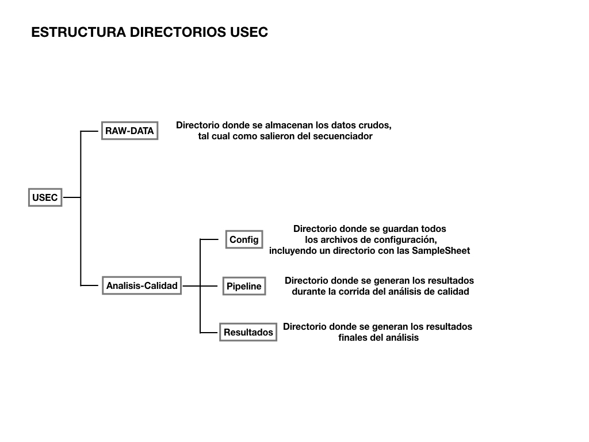
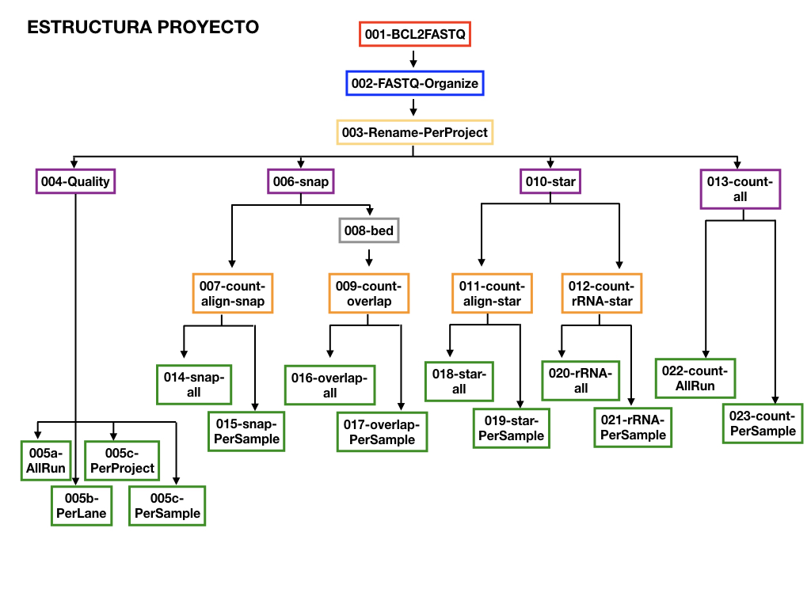

# ANÁLISIS DE CALIDAD PARA DATOS DE SECUENCIACIÓN

## Descripción

Este flujo de trabajo fue creado para la Unidad de Secuenciación del INMEGEN por la Unidad de Servicios Bioinformáticos. Se ha diseñado para analizar datos de secuenciación generados por aparatos MiSeq y HiSeq de Illumina, permitiendo analizar corridas completas, incluso aquéllas para las que existen múltiples "_SampleSheet_", o cuando se ha secuenciado cDNA y DNA en la misma corrida.


**Los resultados generados para cada corrida son:**

 - Archivos FASTQ, organizados por carpetas que pertenecen a los proyectos dentro de la corrida.
 - Reportes MultiQC (por lane, por proyecto, por muestra y para la corrida completa).

**En el caso de secuenciación de DNA, se generan los siguientes reportes adicionales:**

 - Número total de lecturas.
 - Número de lecturas que alinean contra el genoma de referencia.
 - Número de lecturas que alinean contra una lista definida de intervalos genómicos.

**En el caso de secuenciación de RNA, se generan los siguientes reportes adicionales:**

 - Número total de lecturas.
 - Número de lecturas que alinean contra el transcriptoma de referencia.
 - Número de lecturas que alinean contra regiones ribosomales.


## Estructura de directorios del directorio de trabajo de la USEC

El directorio de trabajo de la USEC esta organizado como se muestra en la figura.




## Consideraciones importantes

Es muy importante tener en cuenta las siguientes consideraciones de lo contrario el flujo de trabajo generará resultados inesperados:

✓ Los nombres de las corridas no tienen restricciones.

✓ Se considerará como el nombre de la muestra la información encontrada en la columna **Sample_Name** de la SampleSheet, este campo **no debe de contener guiones bajo "_"**. 

✓ Se considerará como el nombre del proyecto la información encontrada en la columna **Sample_Project** de la SampleSheet, este campo **no debe de contener guiones bajo "_"**.


## Configuración del flujo de trabajo

Antes de cada ejecución se deben preparar los archivos de configuración de la corrida. Para ello es indispensable crear y modificar los archivos de configuración que se deben encontrar en el directorio de configuración y que se describen a continuación. 

### Datos de la corrida

Para que el flujo de trabajo funcione, en el directorio **Config/SampleSheet/** se debe crear un directorio con el nombre de la corrida. Por ejemplo:

```
Analisis-Calidad/Config/SampleSheet/Corrida_Ejemplo/
```

Dentro de este directorio deben de colocarse todas las samplesheets que pertenecen a esta corrida. Los nombres de **los archivos samplesheet** deben de nombrarse con la **terminación ".csv"**.

### Directorio de configuración

Todos los archivos de configuración deben encontrarse en un directorio especial llamado "Config":

```
Analisis-Calidad/Config/
```

Para ejecutar este flujo de trabajo, además del paso anterior, es necesario crear dos tipos de archivos de configuración en el directorio de configuración:

1. Archivo de configuración global `Analisis-Calidad/Config/config.mk`
2. Archivos de configuración por proyecto `Analisis-Calidad/Config/<Sample_Project>.config`

---

### Archivo de configuración global `config.mk`

En este archivo se definen las variables para que el flujo de trabajo identifique donde debe buscar los datos iniciales y donde debe escribir los reportes finales: `SEQ_DATA_DIR`, `RESULTS_DIR` y `SAMPLESHEET_DIR`.

```
SEQ_DATA_DIR=
RESULTS_DIR=
SAMPLESHEET_DIR=
```

En la variable `SEQ_DATA_DIR` se debe definir la ubicación de la carpeta dónde se encuentran los **datos crudos** generados por el secuenciador. La USB recomienda mantener todos los datos crudos en el directorio **"RAW-DATA"** ubicado en la carpeta de trabajo de la USec.

En la variable `RESULTS_DIR` se debe definir la ubicación dónde se escribirán los resultados. **El nombre de la carpeta debe ser único**. Ya que, si se utiliza el nombre de una carpeta que ya exista, el flujo de trabajo sobre-escribirá los resultados y, para algunos archivos, concatenará información produciendo un comportamiento inesperado e incorrecto. La USB recomienda mantener todas las carpetas de resultados en el directorio **"Resultados"** ubicado en el directorio "Analisis-Calidad" en la carpeta de trabajo de la USec.

En la variable `SAMPLESHEET_DIR` se debe definir la ubicación de la carpeta dónde se encuentran las **samplesheet** para esa corrida. La USB recomienda mantener todas las samplesheet en el directorio **Config/SampleSheet/** ubicado en la carpeta de trabajo de la USec.

Para cada una de estas variables, se recomienda modificar únicamente la parte pertinente de la ruta. Por ejemplo:

```
SEQ_DATA_DIR='/labs/usec/RAW-DATA/180911_NS500560_0173_AH5GL3AFXY/'
RESULTS_DIR='/labs/usec/Analisis-Calidad/Resultados/180911_NS500560_0173_AH5GL3AFXY/'
SAMPLESHEET_DIR='/labs/usec/Analisis-Calidad/Config/SampleSheet/180911_NS500560_0173_AH5GL3AFXY/'
```

En este ejemplo el nombre de la corrida es "180911_NS500560_0173_AH5GL3AFXY". Para analizar una corrida nueva se cambiaría únicamente esta parte de la ruta, por el nombre de la corrida a analizar.

---


### Archivos de configuración por proyecto

Estos archivos contienen las variables que definirán las acciones a realizar para los datos de cada uno de los proyectos.

```
Analisis-Calidad/Config/<Sample_Project1>.config
Analisis-Calidad/Config/<Sample_Project2>.config
Analisis-Calidad/Config/<Sample_Project3>.config
...
```

Estos archivos deberán ser nombrados: "NOMBRE-PROYECTO".config. Donde "NOMBRE-PROYECTO" debe corresponder con los **nombres de los proyectos registrados en las samplesheet** (campo "Sample\_Project") provistas en el directorio "SampleSheet". Es importante recordar que **los nombres de los proyectos no deben contener por ningún motivo guiones bajos "\_"**. Una plantilla se proporciona en `/labs/usec/Analisis-Calidad/Config/template.config`.

Estos archivos de configuración definen el comportamiento del flujo de trabajo y deben ser modificados considerando las características de la secuenciación, ya sea DNA o RNA seq. A continuación se detalla las opciones para cada uno de estos tipos de trabajo. 

#### Para proyectos de secuenciación de DNA

Existen dos variables que se deben definir, `SNAP_REFERENCE_DIR` y `BED`. 
En la variable `SNAP_REFERENCE_DIR` se debe definir la ubicación del directorio donde se encuentra el índice de snap que se utilizará.
En la variable `BED` se debe definir la ubicación del archivo que contiene los intervalos de regiones genómicas para las cuales se calculará el porcentaje de alineamiento. Por ejemplo, el bed que describe las regiones blanco de un panel de exones.

Por ejemplo:

```
SNAP_REFERENCE_DIR='/labs/usb/anotacion/Homo_sapiens/ENSEMBL/release-83/snap-index/'
BED='/labs/usec/BEDs/truseq-dna-exome-targeted-regions-manifest-v1-2.bed'
```

Si no se tiene un BED a analizar, estas variables se definirán vacía de la siguiente manera:

```
SNAP_REFERENCE_DIR='/labs/usb/anotacion/Homo_sapiens/ENSEMBL/release-83/snap-index/'
BED=''
```

Cualquier otra línea del archivo de configuración de ese proyecto específico que contenga estas variables debe empezar por el símbolo "#". De la siguiente forma:

```
#SNAP_REFERENCE_DIR=''
SNAP_REFERENCE_DIR='/labs/usb/anotacion/Homo_sapiens/ENSEMBL/release-83/snap-index/'

#BED=''
BED='/labs/usec/BEDs/truseq-dna-exome-targeted-regions-manifest-v1-2.bed'
```

**Sólo se permite que una línea para cada variable no comience con el signo "#"**. 
 Si el proyecto es de secuenciación de RNA, asegúrate que la línea sin el signo "#" sea la que corresponde a la variable vacía. De esta manera:

```
SNAP_REFERENCE_DIR=''
#SNAP_REFERENCE_DIR='/labs/usb/anotacion/Homo_sapiens/ENSEMBL/release-83/snap-index/'

BED=''
#BED='/labs/usec/BEDs/truseq-dna-exome-targeted-regions-manifest-v1-2.bed'
```

---

#### Para proyectos de secuenciación de RNA

Existen dos variables que se deben definir: `STAR_REFERENCE_DIR` y `RRNA`.
En la variable `STAR_REFERENCE_DIR` se debe definir la ubicación del directorio donde se encuentra el índice de STAR que se utilizará.
Mientras que en la variable `RRNA` se debe definir la ubicación del archivo que contiene las posiciones para las regiones de RNA ribosomal.

Por ejemplo:

```
STAR_REFERENCE_DIR='/remote/reference/labshare.cshl.edu/shares/gingeraslab/www-data/dobin/STAR/STARgenomes/ENSEMBL
/homo_sapiens/ENSEMBL.homo_sapiens.release-83/'
RRNA='/labs/usb/anotacion/Homo_sapiens/ENSEMBL/release-83/Homo_sapiens.GRCh38.83.rRNA.bed'
```


Cualquier otra línea del archivo de configuración de ese proyecto específico que contenga estas variables debe empezar por el símbolo "#". De la siguiente forma:

```
#STAR_REFERENCE_DIR=''
STAR_REFERENCE_DIR='/remote/reference/labshare.cshl.edu/shares/gingeraslab/www-data/dobin/STAR/STARgenomes/ENSEMBL
/homo_sapiens/ENSEMBL.homo_sapiens.release-83/'

#RRNA=''
RRNA='/labs/usb/anotacion/Homo_sapiens/ENSEMBL/release-83/Homo_sapiens.GRCh38.83.rRNA.bed'
```

**Sólo se permite que una línea para cada variable no comience con el signo "#"**. 
Si el proyecto es de secuenciación de DNA, asegúrate que la línea sin el signo "#" sea la que corresponde a la variable vacía. De esta manera:

```
STAR_REFERENCE_DIR=''
#STAR_REFERENCE_DIR='/remote/reference/labshare.cshl.edu/shares/gingeraslab/www-data/dobin/STAR/STARgenomes/ENSEMBL
/homo_sapiens/ENSEMBL.homo_sapiens.release-83/'

RRNA=''
#RRNA='/labs/usb/anotacion/Homo_sapiens/ENSEMBL/release-83/Homo_sapiens.GRCh38.83.rRNA.bed'
```

---

## Como ejecutar el flujo de trabajo

La ejecución del flujo de trabajo se hace a través de linea de comandos conectándose al servidor dedicado llamado "Dell1". En este servidor es en donde está ahora instalado.


 1. Conectarse via ssh al servidor Dell1.

	```
	$ ssh <usuario>@192.168.105.222
	```

 2. Activar byobu.

	```
	$ byobu
	```
 3. Veriricar que exista el directorio con las SampleSheet correspondiente

	```
	$ cd /labs/usec/Analisis-Calidad/Config/SampleSheet/
	$ ls
	### DEBE EXISTIR EL DIRECTORIO DE LA CORRIDA
	```


 3. **Modificar cuidadosamente los archivos de configuración de la corrida**.

	```
	### Verificar que exista el directorio con las SampleSheet correspondiente
	$ cd /labs/usec/Analisis-Calidad/Config/SampleSheet/
    $ ls

	### Moverte al directorio de configuracion
	$ cd /labs/usec/Analisis-Calidad/Config/

	### Modificar archivo de configuracion global
	$ nano config.mk
	# Copiar a bitacora de la Usec
	# Modificar la parte correspondiente de la ruta

	### Crear archivo de configuracion por proyecto
	$ cp template.config proyecto1.config
	# Modificar las lineas correspondientes al tipo de experimento	
	
	```

 4. Moverte al directorio base del flujo de trabajo. 
	
	```
	$ cd /labs/usec/Analisis-Calidad/
	```

 5. Ejecutar el flujo de trabajo utilizando la siguiente línea

	```
	$ bash correr-analisis NEW-RUN
	```

	Si estás corriendo el mismo análisis por segunda vez, y no quieres iniciar de cero sino continuar desde donde el flujo de trabajo se paró, ejecutar la siguiente línea

	```
	$ bash correr-analisis RE-RUN
	```

	**El prompt quedará bloqueado mientras el flujo de trabajo siga ejecutándose.**
	
	Puedes salir de byobu utilizando la tecla F6. De esta manera tendrás nuevamente acceso a una terminal y tu proceso se seguirá ejecutando en segundo plano. 
	

## Explorando los resultados

1. Ir al directorio Analisis-Calidad/Resultados

	```
	$ cd /labs/usec/Analisis-Calidad/Resultados
	```

2. Ir al directorio especificado en el archivo de configuración donde se guardarán los resultados de esta corrida

	```
	$ cd <NOMBRE_CORRIDA>
	```

3. Explora tus resultados

---


En la carpeta de resultados existirán los siguientes folders:


**CALIDAD**

Contiene los reportes de calidad por muestra, por proyecto, por lane-proyecto y para la corrida completa


**CUENTAS**

Contiene un archivo con el resumen de la corrida dividido en tres columnas:

 - **DNA-alineo**: Contiene el número de lecturas de los proyectos de secuenciación de DNA que alinearon al genoma de referencia.
 - **RNA-alineo**: Contiene el número de lecturas de los proyectos de secuenciación de RNA que alinearon al transcriptoma de referencia
 - **TOTAL-READS**: Contiene el número de lecturas totales de la corrida de secuenciación


**FASTQ**

Contiene una carpeta por proyecto con todos los archivos fastq generados por proyecto


**DNA-SEQ**

Contiene cuatro archivos:

 - **DNASEQ-total.txt**: Contiene el número de lecturas generadas para cada muestra
 - **DNASEQ-alineado.txt**: Contiene el número de lecturas que alineo al genoma de referencia por muestra
 - **DNASEQ-intervalo.txt**: Contiene el número de lecturas que se encuentran dentro de los intervalos especificados en el archivo BED por muestra.
 - **DNASEQ-Summary.txt**: Contiene un resumen de los tres archivos anteriores. La primer columna corresponde al ID de la muestra, la segunda columna al número de lecturas totales, la tercer columna al número de lecturas que alinea y la cuarta columna al número de lecturas que caen dentro de los intervalos.


**RNA-SEQ**

Contiene cuatro archivos:

 - **RNASEQ-total.txt**: Contiene el número de lecturas generadas para cada muestra
 - **RNASEQ-alineado.txt**: Contiene el número de lecturas que alineo al transcriptoma de referencia por muestra
 - **RNASEQ-ribosomal.txt**: Contiene el número de lecturas que alinean a RNA ribosomal.
 - **RNASEQ-Summary.txt**: Contiene un resumen de los tres archivos anteriores. La primer columna corresponde al ID de la muestra, la segunda columna al número de lecturas totales, la tercer columna al número de lecturas que alinea y
la cuarta columna al número de lecturas que alinenan a RNA ribosomal.
 
**DEBUG**

Sólo existe para propósitos de debugging.

## Herramientas adicionales

Alternativamente se puede usar un cliente de `sshfs`  para montar el sistema de archivos de Dell1 y facilitar tanto el proceso de configuración como el de manipulación y exploración de los resultados. El flujo de trabajo sólo se puede ejecutar en linea de comandos y siempre desde dentro del INMEGEN.


### Mac OS X
En una computadora Mac es necesario instalar FUSE y SSHFS que ambos se puede descargar en [esta liga](https://osxfuse.github.io/).

Luego de la instalación es necesario hacer una carpeta vacía por ejemplo con este comando:

```
$ mkdir -p ~/mnt/dell1
```

Y luego ejecutamos el siguiente comando:

```
$ sshfs <usuario>@192.168.105.222:/ ~/mnt/dell1/ -o local -o volname=DELL1 -o noappledouble -o defer_permissions
```

El servidor se podrá acceder como si fuera un disco duro externo. Navegar hasta la carpeta `/labs/usec/Analisis-Calidad`.

### Windows

Para montar el sistema de archivos de Dell1 en un sistema Windows se requiere la instalación de un cliente SSHFS como por ejemplo [SFTP Net Drive](https://www.nsoftware.com/sftp/netdrive/)

Una vez instalado, se ejecuta el programa y se configura con la siguiente información:

Server: 192.168.105.222  
Username: \<usuario>  
Autentication: Password  
Password: \<user_password>  

Y en el botón "Advanced..." dentro de Drive/Root folder on the server elegir "Server's root folder". Dar click en "OK" y luego "Connect" en la ventana principal.

El servidor se podrá acceder como si fuera un disco duro externo. Navegar hasta la carpeta `/labs/usec/Analisis-Calidad`.

##  Arquitectura del flujo de trabajo

El flujo de trabajo está diseñado modularmente. La arquitectura se muestra en la siguiente figura:




### Dependencias de software

- [samtools](https://samtools.github.io/) v1.5
- [snap](http://snap.cs.berkeley.edu/) v1.0beta.18
- [STAR](https://github.com/alexdobin/STAR/releases) v2.5.0a
- [FastQC] (https://www.bioinformatics.babraham.ac.uk/projects/fastqc/) v0.11.4
- [bcl2fastq] (https://support.illumina.com/downloads/bcl2fastq-conversion-software-v2-20.html) v2.20.0.422
- [multiqc] (https://multiqc.info/) v1.6


## Información de los autores

Desarrollado por: Laura Gomez.
Fecha de última actualización: 14/3/2019
Unidad de Servicios Bioinformáticos.  
Instituto Nacional de Medicina Genómica
email: [lgomez@inmegen.gob.mx](mailto:lgomez@inmegen.gob.mx)


La Dirección de Desarrollo Tecnológico colaboró con la implementación de permisos especiales para el acceso al nodo Dell1 y para los usuarios especiales de la USec


